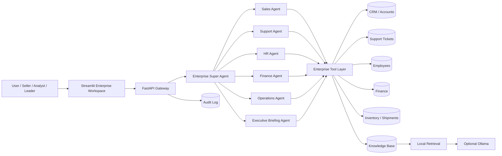

# Enterprise AI Mega Lab

A complete, local-first **enterprise AI engineering sandbox** for building and demonstrating AI agents, RAG, tool use, APIs, orchestration, governance, observability, and business workflows against one fictional company.

The fictional company is **Northstar Dynamics**, a global technology and industrial services company with sales, customer support, HR, finance, supply chain, operations, and executive data. The repository is intentionally designed like a miniature enterprise so that you can build realistic AI solutions without needing access to proprietary systems.

> **Core idea:** one company, many systems, many agents, one reusable lab.

## What you can build here

- Enterprise Super Agent
- Sales lead discovery, enrichment, qualification, meeting preparation, and next-best-action agents
- Customer support triage and escalation agents
- HR workforce and policy assistants
- Finance variance and spend-analysis agents
- Supply-chain and inventory intelligence agents
- Executive briefing agent
- Permission-aware knowledge retrieval
- Agent routing and tool calling
- REST / OpenAPI integrations
- Local RAG with citations
- Optional local LLM generation through Ollama
- Human-in-the-loop approval flows
- AI governance and audit logging
- Agent evaluation and reliability tests

## Architecture



## Repository structure

```text
enterprise-ai-mega-lab/
├── backend/
│   └── app/
│       ├── agents/              # specialist agents + Super Agent
│       ├── routers/             # FastAPI endpoints
│       ├── services/            # database, retrieval, LLM, audit, tools
│       ├── main.py
│       ├── config.py
│       └── schemas.py
├── frontend/
│   └── app.py                   # Streamlit workspace
├── data/
│   ├── accounts.csv
│   ├── contacts.csv
│   ├── opportunities.csv
│   ├── tickets.csv
│   ├── employees.csv
│   ├── finance.csv
│   ├── inventory.csv
│   ├── shipments.csv
│   └── meetings.csv
├── knowledge/                   # company policies, product docs, playbooks
├── docs/                        # architecture, API, governance, security
├── labs/                        # guided enterprise AI exercises
├── scripts/                     # seed and run helpers
├── tests/                       # unit + API tests
├── .env.example
├── requirements.txt
└── README.md
```

## Quick start

### 1. Create a virtual environment

```bash
python -m venv .venv
```

Activate it:

```bash
# macOS / Linux
source .venv/bin/activate

# Windows PowerShell
.venv\Scripts\Activate.ps1
```

### 2. Install dependencies

```bash
pip install -r requirements.txt
```

### 3. Seed the enterprise database

```bash
python scripts/seed_db.py
```

### 4. Start the backend

```bash
uvicorn backend.app.main:app --reload
```

Open API docs at `http://localhost:8000/docs`.

### 5. Start the frontend

In a second terminal:

```bash
streamlit run frontend/app.py
```

The default UI expects the backend at `http://localhost:8000`.

## Optional: use Ollama

The lab works without a hosted model. By default, it uses deterministic routing, structured business rules, and local retrieval. To add natural-language generation with a local model:

```bash
ollama pull llama3.2
```

Then copy `.env.example` to `.env` and set:

```text
USE_OLLAMA=true
OLLAMA_MODEL=llama3.2
```

## Example questions

Try these in the UI or with `POST /agents/ask`:

- "Find the best sales opportunities and explain why."
- "Who should I contact at RedStone Energy about network modernization?"
- "Prepare me for my meeting with Apex Manufacturing."
- "Which support tickets need immediate escalation?"
- "What are the biggest finance variances this month?"
- "Which inventory items are at risk of stockout?"
- "Summarize the most important issues the executive team should know today."
- "What is our travel reimbursement policy?"

## Example API request

```bash
curl -X POST http://localhost:8000/agents/ask \
  -H "Content-Type: application/json" \
  -d '{"message":"Find the best sales opportunities"}'
```

## Agent catalog

| Agent | Responsibility |
| --- | --- |
| Enterprise Super Agent | Understands intent, routes work, coordinates specialists, and combines results |
| Sales Agent | Accounts, contacts, opportunities, qualification, meeting prep, next best action |
| Support Agent | Ticket triage, severity, routing, customer-risk escalation |
| HR Agent | Employee data, workforce insights, HR knowledge and policy Q&A |
| Finance Agent | Spend, budget variance, anomalies, cost drivers |
| Operations Agent | Inventory, shipments, supplier and operational risk |
| Executive Agent | Cross-functional briefings, priorities, risks, recommended actions |
| Knowledge Agent | Local enterprise knowledge retrieval with source citations |

## Enterprise tool layer

Agents do not query CSV files directly. They use a shared tool layer that acts like a simplified enterprise integration tier. This makes it easy to replace the built-in SQLite data with APIs such as Salesforce, ServiceNow, Workday, SAP, Outlook, Teams, or custom OpenAPI services later.

## Safety and governance built into the lab

The repository demonstrates several production-oriented controls:

- tool allowlists by agent
- explicit human approval pattern for write actions
- read-only default behavior
- audit logging of agent requests and selected routes
- source citations for knowledge retrieval
- deterministic fallback when a model is unavailable
- prompt-injection guidance
- PII minimization guidance
- evaluation tests

See `docs/GOVERNANCE.md` and `docs/SECURITY.md`.

## Guided labs

The `labs/` folder turns the repository into a hands-on learning environment. Start with `labs/00-lab-index.md` and progress from API exploration to Super Agent orchestration, RAG, evaluation, governance, and production hardening.

## Suggested portfolio extensions

1. Replace the SQLite CRM with Salesforce.
2. Add Outlook and Teams tools.
3. Add a vector database such as Chroma or FAISS.
4. Add MCP servers for enterprise tools.
5. Add SSO and role-based access control.
6. Add agent traces and token/cost metrics.
7. Deploy to a cloud platform.
8. Add real-time event streams.
9. Add workflow approvals.
10. Add multi-agent planning and reflection.

## License

MIT. See `LICENSE`.
